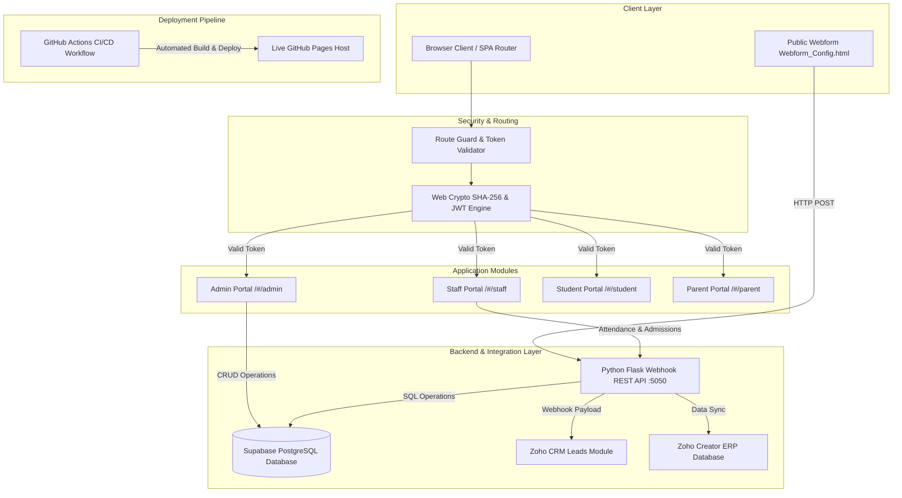

# 🏫 School Management System (SMS) ERP
## Technical Architecture, System Plan & Operational Specification

---

## 1. Executive Summary & Overview

The **School Management System (SMS) ERP** is an enterprise-grade academic management platform built for modern educational institutions. The platform integrates a client-side Single Page Application (SPA) frontend with a Python Flask Webhook REST API, a remote Supabase PostgreSQL Cloud Database, and bidirectional sync capabilities with Zoho CRM & Zoho Creator.

### Key Highlights & Objectives Achieved
* **Modern Enterprise UI**: High-contrast, slate-themed layout (`Background #F6F7F9`, `Cards #FFFFFF`, `Primary #2563EB`) featuring a left sidebar navigation layout, compact KPI metrics cards, Lucide-style vector icons, and structured 8px/6px border-radius design tokens.
* **Role-Based Access Control (RBAC)**: Dedicated multi-tenant access for **System Administrators**, **Teachers/Staff**, **Students**, and **Parents** with isolated views and action capabilities.
* **Cryptographic Auth & Token Security Engine**: Web Crypto API (`SHA-256`) password hashing and signed JWT-style session tokens stored in `sessionStorage`, backed by strict client-side Route Guards.
* **Deterministic Round-Robin Timetable Engine**: Manages 15 faculty teachers across 10 classes (Classes 1–10) over a 6-day academic week (3 periods/day) while enforcing a strict maximum load cap of **3 periods per teacher per day**.
* **Admission Lead Review & Staff Attribution Workflow**: Allows both external applicants via a webform and internal teaching staff to submit admission enquiries. Staff submissions carry a `Requested By (Staff)` attribution badge. Admins review applications in a sliding drawer modal (`✓ Accept & Confirm Admission`) which automatically generates Student IDs (`STD-2026-XXXX`) and default credentials.
* **Parent Fee Ledger & Online Gateway**: Provides parents with term-by-term fee breakdowns, transaction histories, and a 1-click online payment gateway simulation updating status to `PAID`.
* **CI/CD & Live Cloud Hosting**: Deployed automatically to **GitHub Pages** via GitHub Actions workflow (`.github/workflows/static.yml`).

---

## 2. System Architecture & End-to-End Topology



---

## 3. Role-Based Access Control (RBAC) Matrix

| Module / Feature | 👑 System Admin | 👨‍🏫 Teacher / Staff | 🎓 Student | 👨‍👩‍👧 Parent |
| :--- | :---: | :---: | :---: | :---: |
| **Full ERP System Settings** | ✅ Full Access | ❌ Denied | ❌ Denied | ❌ Denied |
| **All Student Records (Classes 1–10)** | ✅ Read & Edit All 200 | 👁️ View Assigned | 👁️ View Self Only | 👁️ View Child Only |
| **Faculty Roster & Workload Monitor** | ✅ Read & Edit 15 | 👁️ View Self Schedule | ❌ Denied | ❌ Denied |
| **Master Timetable Allocation** | ✅ Re-assign & Edit | 👁️ View Personal | 👁️ View Class Schedule | ❌ Denied |
| **Admission Application Approval** | ✅ Accept / Reject | 📝 Submit Application | ❌ Denied | ❌ Denied |
| **Admission Staff Attribution Badge** | 👁️ View Staff Name | 📝 Tagged as Requestor | ❌ Denied | ❌ Denied |
| **Daily Class Attendance Logging** | ✅ Overview & Audit | 📝 Submit Attendance | 👁️ View Self % | 👁️ View Child % |
| **Parent Fee Ledger & Online Payment** | 👁️ Audit Fee Status | ❌ Denied | ❌ Denied | 💳 Pay Online & View |

---

## 4. Comprehensive Module Specifications

### Module 1: Authentication & Token Security Engine
* **Password Hashing**: Implements standard `SHA-256` hashing via `crypto.subtle.digest('SHA-256', ...)` on raw user input.
* **Tokenization**: Issues signed HS256-style JWT tokens (`SMS_ERP_SECRET_KEY_2026_PROD`) with a 24-hour expiration payload stored in `sessionStorage` (`sms_auth_token`).
* **Route Guards**: On hash navigation (`/#/admin`, `/#/staff`, etc.), `handleRoute()` verifies the token signature and expiration. Unauthenticated requests are intercepted and bounced to the standalone full-screen Login Screen (`/#/login`).
* **Standalone Full-Screen Login Page**: On logout (`logout()`), the main ERP layout container (`.sidebar` and `.app-layout`) is set to `display: none`, displaying only the dedicated full-screen login card with role selection buttons.

### Module 2: Admission & Lead Intake Workflow
* **Public & Staff Enquiries**: Supports admissions submitted through `Webform_Config.html` or internally by teachers via `/#/staff/admissions`. Staff submissions are tagged with `Requested By (Staff)` (e.g. *Dr. Ramesh Kumar*).
* **Compact Admissions Table**: Displays pending leads with columns: `ID`, `Student Name`, `Grade`, `Requested By`, `Status`, and `Action`.
* **Sliding Admission Review Drawer**: Clicking **Review** slides out a right drawer modal with complete applicant details, parent info, and action buttons (`Cancel / Reject` and `✓ Accept & Confirm Admission`). Accepting auto-enrolls the student into the class roster with a generated Student ID (`STD-2026-XXXX`).

### Module 3: Student & Class Roster Engine
* **Complete Academic Scope**: Covers **Classes 1 to 10** with 20 enrolled students per grade (200 total enrolled students).
* **Admin Management**: Admins can filter by class, search by name, edit student details (Roll Number, Parent Contact, Section), and add new students to the roster.

### Module 4: 15-Teacher Faculty & Round-Robin Timetable Engine
* **Faculty Roster**: 15 specialized subject teachers (Mathematics, Physics, Chemistry, Computer Science, English, Social Studies, Biology, Hindi, Physical Education).
* **Workload Enforcement**: Capped at a maximum load of **3 periods per teacher per day** to prevent burnout.
* **6-Day Rotation Schedule**: Calculates deterministic timetable slots across Monday through Saturday (3 periods per day: 09:00 AM, 10:00 AM, 11:15 AM).
* **Admin Slot Re-assignment**: Admins can edit any slot to re-assign subject teachers or change classroom locations.

### Module 5: Attendance Register & Performance Monitor
* **Daily Class Marking**: Teachers select their assigned grade, mark students Present/Absent using quick toggles or a **Mark All Present** action, and log the attendance record.
* **KPI Metrics**: Displays real-time operational metrics (e.g. *96.4% Attendance Today*, *+2.4% from yesterday*).

### Module 6: Parent Fee Ledger & Gateway
* **Ledger Breakdown**: Shows term-by-term tuition breakdown (Term 1, Term 2, Term 3).
* **Online Payment Gateway Simulation**: Allows parents to complete pending fee payments online, generating a transaction reference (`TXN-2026-99482`) and updating status badges to `PAID`.

---

## 5. Master Data Schemas & Models

### Student Schema (`database.students`)
```json
{
  "id": "STD-2026-1001",
  "name": "Aarav Sharma",
  "class": "Class 10",
  "rollNo": 1,
  "parent": "Vikram Sharma",
  "parentEmail": "vikram.sharma@example.com",
  "feeStatus": "Paid"
}
```

### Teacher Schema (`teachersList`)
```json
{
  "id": "TCH-101",
  "name": "Dr. Ramesh Kumar",
  "subject": "Mathematics Specialist",
  "email": "ramesh.kumar@school.edu",
  "classesAssigned": ["Class 8", "Class 9", "Class 10"],
  "dailyMaxPeriods": 3
}
```

### Admission Enquiry Schema (`admissionEnquiries`)
```json
{
  "id": "ENQ-101",
  "name": "Rohan Verma",
  "parent": "Sanjay Verma",
  "email": "sanjay.verma@example.com",
  "grade": "8",
  "requestedBy": "Dr. Ramesh Kumar (Staff)",
  "status": "Pending"
}
```

---

## 6. Live Infrastructure & CI/CD Pipeline

```text
GitHub Repository:  https://github.com/yashraj2408/school-management-system
Live Host (Pages):  https://yashraj2408.github.io/school-management-system/
Supabase Project:   awvtyjzhkqcgbjicntep (ap-southeast-2)
Webhook REST API:   http://127.0.0.1:5050
Local HTTP Server:  http://127.0.0.1:8080
```

### Automated GitHub Actions Workflow (`.github/workflows/static.yml`)
```yaml
name: Deploy static content to Pages
on:
  push:
    branches: ["main"]
permissions:
  contents: read
  pages: write
  id-token: write
jobs:
  deploy:
    environment:
      name: github-pages
      url: ${{ steps.deployment.outputs.page_url }}
    runs-on: ubuntu-latest
    steps:
      - name: Checkout
        uses: actions/checkout@v4
      - name: Setup Pages
        uses: actions/configure-pages@v5
      - name: Upload artifact
        uses: actions/upload-pages-artifact@v3
        with:
          path: 'docs'
      - name: Deploy to GitHub Pages
        id: deployment
        uses: actions/deploy-pages@v4
```

---

## 7. Master Credentials Directory

### 👑 Administrator Account
| Role | Email / Username | Password | Access Scope |
| :--- | :--- | :--- | :--- |
| **System Admin** | `admin@school.edu` | `Admin@2026` | Full ERP Control Across All 200 Students, 15 Teachers, Timetables & Approvals |

### 👨‍🏫 Teacher / Staff Accounts
| Staff Name | Email / Username | Password | Subject Specialization |
| :--- | :--- | :--- | :--- |
| **Dr. Ramesh Kumar** | `ramesh.kumar@school.edu` | `Staff@2026` | Mathematics Specialist |
| **Prof. Vikram Malhotra** | `vikram.malhotra@school.edu` | `Staff@2026` | Physics Specialist |
| **Dr. Sneha Paul** | `sneha.paul@school.edu` | `Staff@2026` | Chemistry Specialist |
| **Ms. Neha Sharma** | `neha.sharma@school.edu` | `Staff@2026` | Computer Science Specialist |

### 🎓 Student Accounts
| Class | Student ID | Student Name | Email / Username | Password |
| :--- | :--- | :--- | :--- | :--- |
| **Class 10** | `STD-2026-1001` | Aarav Sharma | `aarav.sharma@student.edu` | `Student@2026` |
| **Class 9** | `STD-2026-901` | Rahul Gupta | `rahul.gupta@student.edu` | `Student@2026` |
| **Class 8** | `STD-2026-801` | Rohan Verma | `rohan.verma@student.edu` | `Student@2026` |
| **Class 1** | `STD-2026-101` | Priya Singh | `priya.singh@student.edu` | `Student@2026` |

### 👨‍👩‍👧 Parent Accounts
| Parent Name | Email / Username | Password | Linked Child & Class |
| :--- | :--- | :--- | :--- |
| **Vikram Sharma** | `vikram.sharma@example.com` | `Parent@2026` | Aarav Sharma (Class 10) |
| **Sanjay Verma** | `sanjay.verma@example.com` | `Parent@2026` | Rohan Verma (Class 8) |
