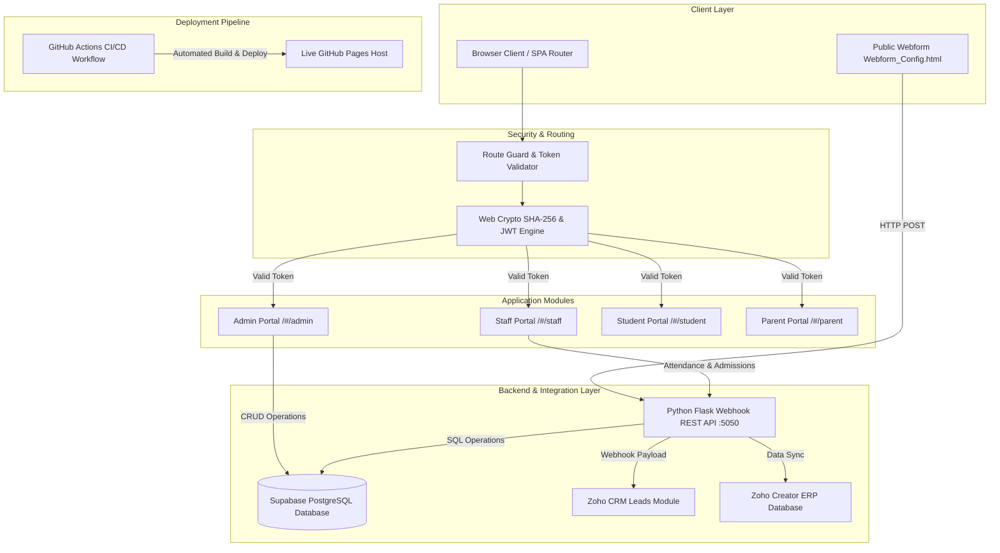

# 🏫 School Management System (SMS) ERP
## Technical Architecture, System Plan & Operational Specification

---

## 1. Executive Summary & Overview

The **School Management System (SMS) ERP** is an enterprise-grade academic management platform built for modern educational institutions. The platform integrates a client-side Single Page Application (SPA) frontend with a Python Flask Webhook REST API, a remote Supabase PostgreSQL Cloud Database, and bidirectional sync capabilities with Zoho CRM & Zoho Creator.

### Key Highlights & Objectives Achieved
* **Modern Enterprise UI**: High-contrast, slate-themed layout (`Background #F6F7F9`, `Cards #FFFFFF`, `Primary #2563EB`) featuring a left sidebar navigation layout, compact KPI metrics cards, Lucide-style vector icons, and structured 8px/6px border-radius design tokens.
* **Role-Based Access Control (RBAC)**: Dedicated multi-tenant access for **System Administrators**, **Teachers/Staff**, **Students**, and **Parents** with isolated views and action capabilities.
* **Cryptographic Auth & Token Security Engine**: Web Crypto API (`SHA-256`) password hashing and signed JWT-style session tokens stored in `sessionStorage`, backed by strict client-side Route Guards.
* **Deterministic Round-Robin Timetable Engine**: Manages 15 faculty teachers across 10 classes (Classes 1–10) over a 6-day academic week (3 periods/day) while enforcing a strict maximum load cap of **3 periods per teacher per day**.
* **Admission Lead Review & Staff Attribution Workflow**: Allows both external applicants via a webform and internal teaching staff to submit admission enquiries. Staff submissions carry a `Requested By (Staff)` attribution badge. Admins review applications in a sliding drawer modal (`✓ Accept & Confirm Admission`) which automatically generates Student IDs (`STD-2026-XXXX`) and default credentials.
* **Parent Fee Ledger & Online Gateway**: Provides parents with term-by-term fee breakdowns, transaction histories, and a 1-click online payment gateway simulation updating status to `PAID`.
* **CI/CD & Live Cloud Hosting**: Deployed automatically to **GitHub Pages** via GitHub Actions workflow (`.github/workflows/static.yml`).

---

## 2. System Architecture & End-to-End Topology



---

## 3. Role-Based Access Control (RBAC) Matrix

| Module / Feature | 👑 System Admin | 👨‍🏫 Teacher / Staff | 🎓 Student | 👨‍👩‍👧 Parent |
| :--- | :---: | :---: | :---: | :---: |
| **Full ERP System Settings** | ✅ Full Access | ❌ Denied | ❌ Denied | ❌ Denied |
| **All Student Records (Classes 1–10)** | ✅ Read & Edit All 200 | 👁️ View Assigned | 👁️ View Self Only | 👁️ View Child Only |
| **Faculty Roster & Workload Monitor** | ✅ Read & Edit 15 | 👁️ View Self Schedule | ❌ Denied | ❌ Denied |
| **Class & Personal Timetables** | ✅ Re-assign & Edit | 👁️ View Personal (3/day) | 👁️ View Class Schedule | 👁️ View Child Timetable |
| **Exam Section & Marks Entry** | ✅ Global Gradebook | 📝 Enter & Edit Marks | 👁️ View Report Card | 👁️ View Child Grades |
| **Exam Schedule & Dates** | ✅ Manage Schedules | 👁️ Audit Exam Dates | 👁️ View Hall & Dates | 👁️ View Exam Dates |
| **Admission Application Approval** | ✅ Accept / Reject | 📝 Submit Lead Form | ❌ Denied | ❌ Denied |
| **Daily Class Attendance Register** | ✅ Audit All Classes | 📝 Log Class Attendance | 👁️ View Self % | 👁️ View Child % |
| **Parent Fee Ledger & Online Payment** | ✅ Global Dues Audit | ❌ Denied | ❌ Denied | 💳 View Dues & Pay Online |

---

## 4. Comprehensive Module Specifications

### Module 1: Authentication & Token Security Engine
* **Password Hashing**: Implements standard `SHA-256` hashing via `crypto.subtle.digest('SHA-256', ...)` on raw user input.
* **Tokenization**: Issues signed HS256-style JWT tokens (`SMS_ERP_SECRET_KEY_2026_PROD`) with a 24-hour expiration payload stored in `sessionStorage` (`sms_auth_token`).
* **Route Guards**: On hash navigation (`/#/admin`, `/#/staff`, etc.), `handleRoute()` verifies the token signature and expiration. Unauthenticated requests are intercepted and bounced to the standalone full-screen Login Screen (`/#/login`).
* **Standalone Full-Screen Login Page**: On logout (`logout()`), the main ERP layout container (`.sidebar` and `.app-layout`) is set to `display: none`, displaying only the dedicated full-screen login card with role selection buttons.

### Module 2: Role-Specific Portal Specifications

#### 👑 1. System Administrator Portal (`/#/admin`)
* **ALL ACCESS & Full System Control**: Complete read, create, edit, re-assign, and delete access across all 200 Students (Classes 1–10), 15 Faculty Teachers, Master Class Timetables, Admission Approvals & Drawers, Attendance Registers, Global Exam Gradebooks, and Global Fee Dues Audits.

#### 👨‍🏫 2. Teacher & Staff Portal (`/#/staff`)
* **Daily Attendance Register**: Select assigned class section, toggle Present/Absent per student, use **Mark All Present**, and log attendance.
* **Teacher Timetable**: Displays personal 3-period daily schedule (Mathematics: Classes 8, 9, 10 in Rooms 204, 301, 402) enforcing the **max 3 periods/day** cap.
* **Exam Section (Gradebook)**: Enter Mid-Term and Final Exam Marks for assigned students with automatic letter grade calculation (A+, A, B, C, F) and gradebook record logging.
* **Submit Admission Form**: Submit new student admission enquiries tagged with the `Requested By (Staff)` attribution badge for Admin drawer review.

#### 🎓 3. Student Portal (`/#/student`)
* **RESTRICTED PERSONAL VIEW ONLY**: Students have isolated read-only access displaying strictly their own 4 academic components:
  1. 📅 **Class Timetable**: Weekly Mon–Sat 3-period class timetable with subject, teacher name, and room numbers.
  2. 🎓 **Marks & Subject Report Card**: Detailed subject marks table (Mathematics 95/100 A+, Physics 92/100 A, Chemistry 88/100 A, Computer Science 98/100 A+) with overall GPA (3.92 / 4.0) and teacher feedback notes.
  3. 📊 **Attendance Status & %**: Live attendance tracking badge (*96.5% Attendance*, *114 / 118 Days Present*).
  4. 📝 **Upcoming Exams Timetable & Dates**: Upcoming Mid-Term and Final examination dates, times, subjects, and assigned Exam Halls.

#### 👨‍👩‍👧 4. Parent Portal (`/#/parent`)
* **RESTRICTED CHILD VIEW ONLY**: Parents have isolated access displaying strictly their child's 5 components:
  1. 📅 **Student Timetable**: View child's (Aarav Sharma - Class 10) weekly period schedule.
  2. 🎓 **Student Marks**: Subject-wise Mid-Term & Final examination marks & report card (Maths 95/100 A+, Physics 92/100 A, Chemistry 88/100 A, CS 98/100 A+).
  3. 📝 **Upcoming Exams**: Dates, times, subjects, and exam halls for child's upcoming mid-term & final examinations.
  4. 💰 **Fee Paid Status & Fee Dues Breakdown**: Term 1 ($1,500 Paid), Term 2 ($1,200 Paid), Term 3 ($1,000 Total, **$450 Outstanding Balance**). Includes interactive **Pay Outstanding Balance ($450.00)** button generating transaction receipts (`TXN-2026-99482`) and updating status to `PAID`.
  5. 📊 **Attendance for Their Child**: Child's live attendance rate (*96.5% Attendance*, *114 / 118 Days Present*).

### Module 5: Attendance Register & Performance Monitor
* **Daily Class Marking**: Teachers select their assigned grade, mark students Present/Absent using quick toggles or a **Mark All Present** action, and log the attendance record.
* **KPI Metrics**: Displays real-time operational metrics (e.g. *96.4% Attendance Today*, *+2.4% from yesterday*).

### Module 6: Parent Fee Ledger & Gateway
* **Ledger Breakdown**: Shows term-by-term tuition breakdown (Term 1, Term 2, Term 3).
* **Online Payment Gateway Simulation**: Allows parents to complete pending fee payments online, generating a transaction reference (`TXN-2026-99482`) and updating status badges to `PAID`.

---

## 5. Master Data Schemas & Models

### Student Schema (`database.students`)
```json
{
  "id": "STD-2026-1001",
  "name": "Aarav Sharma",
  "class": "Class 10",
  "rollNo": 1,
  "parent": "Vikram Sharma",
  "parentEmail": "vikram.sharma@example.com",
  "feeStatus": "Paid"
}
```

### Teacher Schema (`teachersList`)
```json
{
  "id": "TCH-101",
  "name": "Dr. Ramesh Kumar",
  "subject": "Mathematics Specialist",
  "email": "ramesh.kumar@school.edu",
  "classesAssigned": ["Class 8", "Class 9", "Class 10"],
  "dailyMaxPeriods": 3
}
```

### Admission Enquiry Schema (`admissionEnquiries`)
```json
{
  "id": "ENQ-101",
  "name": "Rohan Verma",
  "parent": "Sanjay Verma",
  "email": "sanjay.verma@example.com",
  "grade": "8",
  "requestedBy": "Dr. Ramesh Kumar (Staff)",
  "status": "Pending"
}
```

---

## 6. Live Infrastructure & CI/CD Pipeline

```text
GitHub Repository:  https://github.com/yashraj2408/school-management-system
Live Host (Pages):  https://yashraj2408.github.io/school-management-system/
Supabase Project:   awvtyjzhkqcgbjicntep (ap-southeast-2)
Webhook REST API:   http://127.0.0.1:5050
Local HTTP Server:  http://127.0.0.1:8080
```

### Automated GitHub Actions Workflow (`.github/workflows/static.yml`)
```yaml
name: Deploy static content to Pages
on:
  push:
    branches: ["main"]
permissions:
  contents: read
  pages: write
  id-token: write
jobs:
  deploy:
    environment:
      name: github-pages
      url: ${{ steps.deployment.outputs.page_url }}
    runs-on: ubuntu-latest
    steps:
      - name: Checkout
        uses: actions/checkout@v4
      - name: Setup Pages
        uses: actions/configure-pages@v5
      - name: Upload artifact
        uses: actions/upload-pages-artifact@v3
        with:
          path: 'docs'
      - name: Deploy to GitHub Pages
        id: deployment
        uses: actions/deploy-pages@v4
```

---

## 7. Master Credentials Directory

### 👑 Administrator Account
| Role | Email / Username | Password | Access Scope |
| :--- | :--- | :--- | :--- |
| **System Admin** | `admin@school.edu` | `Admin@2026` | Full ERP Control Across All 200 Students, 15 Teachers, Timetables & Approvals |

### 👨‍🏫 Teacher / Staff Accounts
| Staff Name | Email / Username | Password | Subject Specialization |
| :--- | :--- | :--- | :--- |
| **Dr. Ramesh Kumar** | `ramesh.kumar@school.edu` | `Staff@2026` | Mathematics Specialist |
| **Prof. Vikram Malhotra** | `vikram.malhotra@school.edu` | `Staff@2026` | Physics Specialist |
| **Dr. Sneha Paul** | `sneha.paul@school.edu` | `Staff@2026` | Chemistry Specialist |
| **Ms. Neha Sharma** | `neha.sharma@school.edu` | `Staff@2026` | Computer Science Specialist |

### 🎓 Student Accounts
| Class | Student ID | Student Name | Email / Username | Password |
| :--- | :--- | :--- | :--- | :--- |
| **Class 10** | `STD-2026-1001` | Aarav Sharma | `aarav.sharma@student.edu` | `Student@2026` |
| **Class 9** | `STD-2026-901` | Rahul Gupta | `rahul.gupta@student.edu` | `Student@2026` |
| **Class 8** | `STD-2026-801` | Rohan Verma | `rohan.verma@student.edu` | `Student@2026` |
| **Class 1** | `STD-2026-101` | Priya Singh | `priya.singh@student.edu` | `Student@2026` |

### 👨‍👩‍👧 Parent Accounts
| Parent Name | Email / Username | Password | Linked Child & Class |
| :--- | :--- | :--- | :--- |
| **Vikram Sharma** | `vikram.sharma@example.com` | `Parent@2026` | Aarav Sharma (Class 10) |
| **Sanjay Verma** | `sanjay.verma@example.com` | `Parent@2026` | Rohan Verma (Class 8) |
